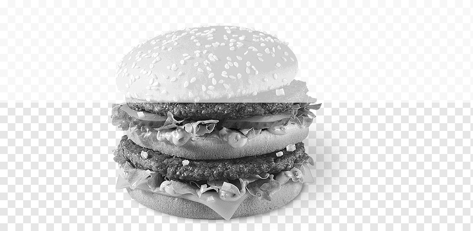
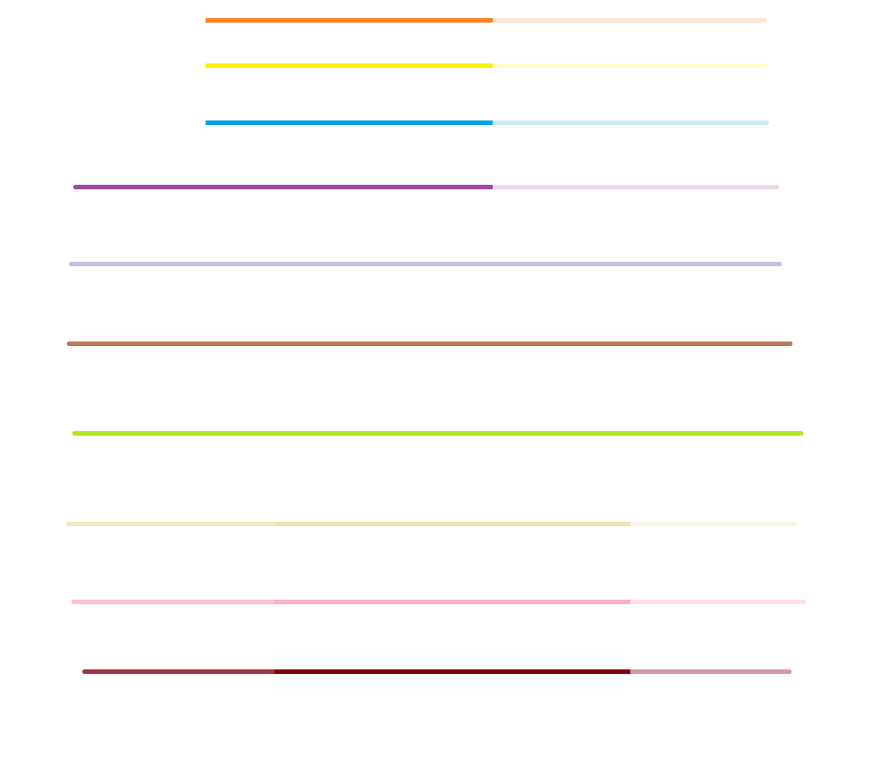

# PNGreader

## Purpose of the project
- learning Python  
- reading comprehension of raw documentation without any additional help  
- training coding structure for big projects  

---

## Description
This project wants to be a rudimentary PNG reader for educational purposes, a PNG decoder so to speak. Everything is implemented by me manually, without additional help from external libraries. I am aware that it is slow being written in Python.

**Informations that you can get:**
- Resolution of the file (H x W)
- Color type (0, 2, 3, 4, 6)
- Bit depth (1, 2, 4, 8, 16, according to the Color Type)
- Interlace (True / False)
- Chunks that build up the file
- Number of blocks in the ZLIB format
- Number of distinct pixels and the pixels themselves  

Pixel format:  'colored_square #RGB_code Opacity_percent'

RGB_code is in the following hex format:  'hex(R_value)hex(G_value)hex(B_value)'


## Usage
    Run 'main.py':
 ```
    python main.py [path_to_png]
```

<details>
<summary>Grayscale sample</summary>


</details>

<details>
<summary>RGB sample</summary>


</details>

<details>
<summary>Palette sample</summary>


</details>

<details>
<summary>Grayscale + alpha sample</summary>



</details>

<details>
<summary>RGB + alpha sample</summary>



</details>

<details>
<summary>Big file sample</summary>


</details>
---

## Implementation details
There are 5 pixel classes, representing each Color Type. Each class has the same format so that they can be casted into a dictionary table in pairs: '(color_type : pixel_color_type_class)'

The implementation of each class has:
- a constructor that regards bit depth  
- a reading generator function, that can facilitate the reading of bits  

**Supported chunks:** `IHDR`, `PLTE`, `IDAT`, `IEND`  
- There is room for scalability. You can further add support for other types of chunks by creating child classes of the `Chunk` class in `chunks.py`.
- `IHDR` is straightforward in implementation, following the format and reading byte by byte the data.
- `PLTE` does the same, with the mention that it uses `Pixel_2` as palette entry. In fact, the palette is an array of size `2^color_depth` of `Pixel_2`.
- `IDAT` is reading byte by byte.

---

### ZLIB decompress
Putting `IDAT` data chunks together, the decompression starts by decoding each block of data.

- Each block uses 2 tries data structures for Huffman decodings:  
  - one for literal/length  
  - another one for distance  

The `trie` class has a constructor that creates a Huffman Trie with the restriction:  '|huffman(alphabet_i)| = length_i'

with a sorted alphabet.  

- The trie itself is implemented offline with static memory. Each node of the trie is an index into an array with an upper bound of `sum(length_i)`.  
- Huffman codes use numbers in base 2 for representation.  
- For dynamic compression blocks, a third trie is created for decoding the lengths arrays.  
- For reading bits in **LSB → MSB** order, a generator function is used to facilitate that, keeping track of the position in the byte.  

Lengths and distances information are placed into 2 arrays structured together under the `Table` class:  
- `extra_bits`  
- `lengths`  

#### Why tries are encoded into lengths form
1. Every interpretation of the code is unique.  
   - Codes with the same length must be lexicographically the same as their value in the alphabet.  
   - Codes with shorter length must be lexicographically smaller than the ones with bigger length.  
   - This guarantees uniqueness.  
2. It disregards the need of knowing the alphabet in the encoding.  
3. The tries themselves are well balanced, leading to approximately `log2(n)` maximum code length, where `n = |alphabet|`.  

After the block is decompressed, the tries are deleted from memory and created again in the next run.

---

### Interlacing
Not supported.

---

### Colors in the terminal
Used ANSII Escape Codes:  

```
Changing background color: ESC[48;2;R;G;Bm
Changing foreground color: ESC[38;2;R;G;Bm]
Reseting: ESC[m
```

Because of the limited number of bits that are supported in the terminal, the colors are capped in 8 bits. So for 16 bit colors, they will suffer a loss of quality in the terminal
---

## Bibliography
- https://datatracker.ietf.org/doc/html/rfc1950  
- https://www.rfc-editor.org/rfc/rfc1951.html  
- https://www.rfc-editor.org/rfc/rfc2083.html  
- https://en.wikipedia.org/wiki/ANSI_escape_code  
- https://www.geeksforgeeks.org/python/inheritance-in-python/  
